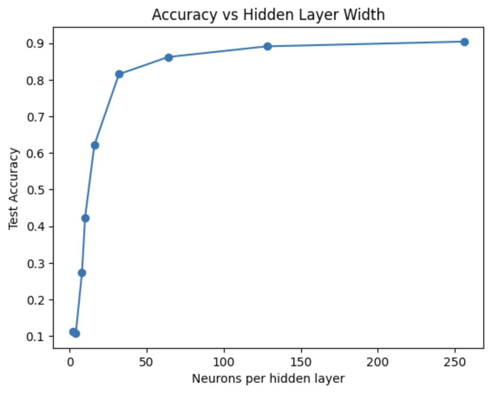
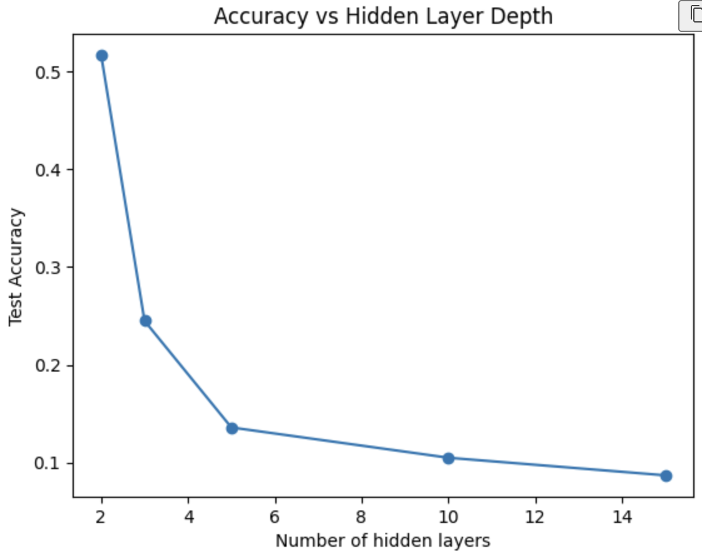
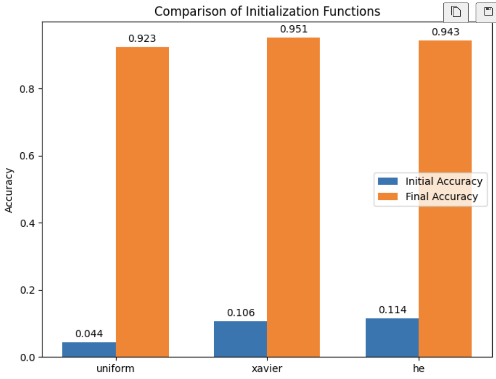
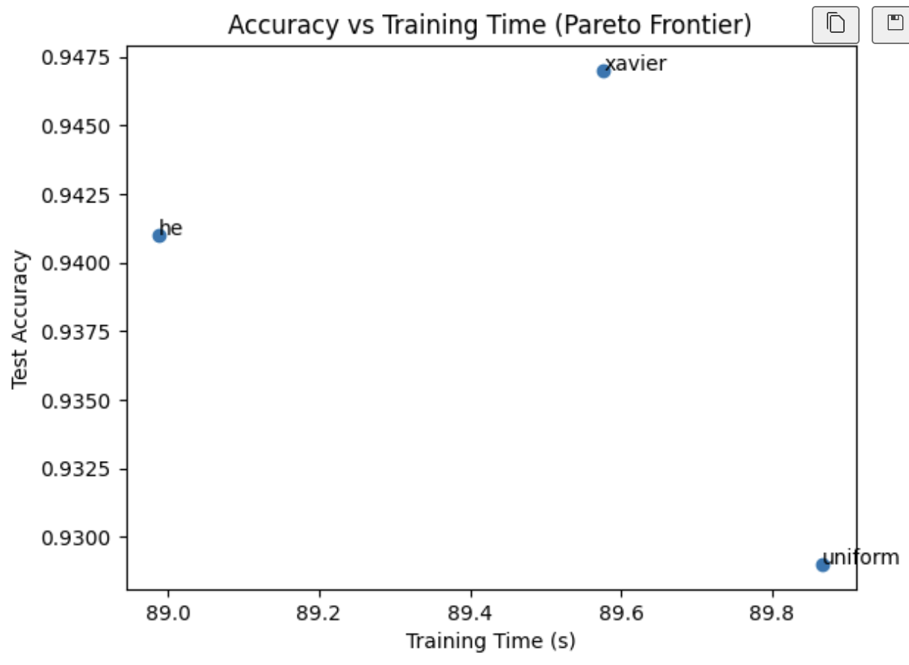
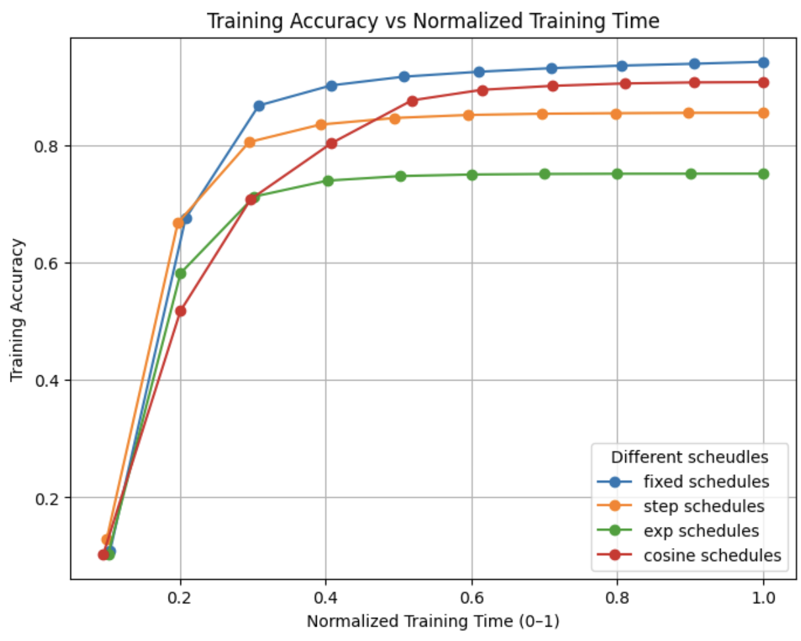
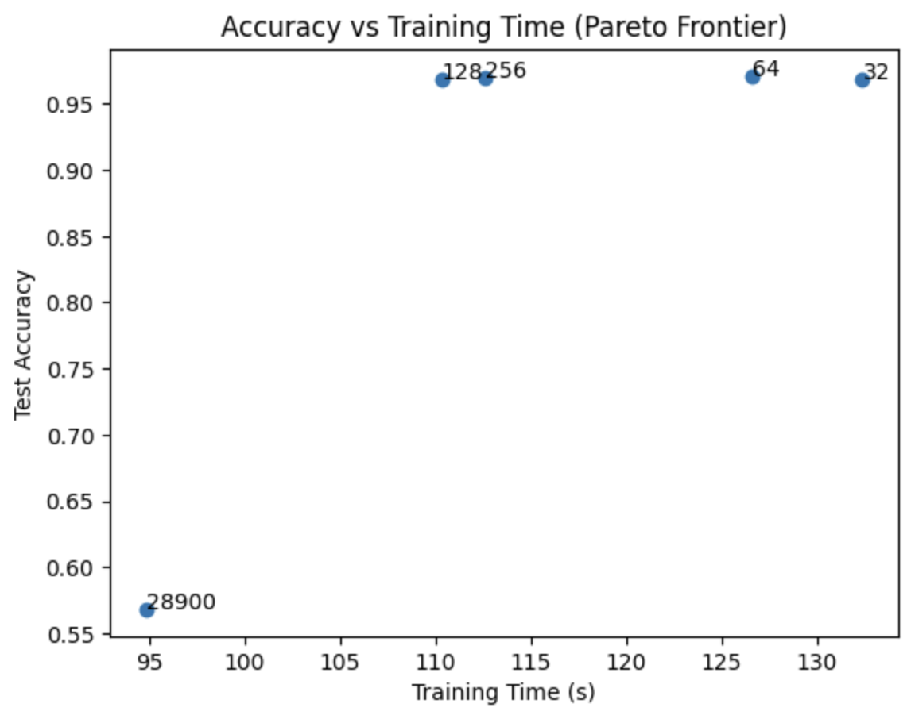

# VariableMLP: A From-Scratch MLP Demonstrating Architecture Scaling and Training Analysis  
VariableMLP is a project made to demonstrate the various effects different parameters can have on the training and prediction of Machine Learning Models. The model utilized in this repository is a simple but classic multi-layer perceptron (MLP) implemented with only NumPy and no high level libraries. This way, interested individuals who are new to the field can click into any file and read the code to fully understand any class or method used. 

To me, taking the first step into the machine learning world was very difficult with all of these daunting complex repositories and frameworks. This repository wishes to serve as a pedagogical resource that can help any beginner understand the core fundementals of ML, and become a stepping stone for their future exploration into this fascinating world. 


## 📌 Overview  
This project implements a **Multi-Layer Perceptron (MLP) from scratch in NumPy** as a framework for studying how architectural scaling and optimization choices affect training on the MNIST dataset. While MLPs on MNIST are a well-established benchmark, this work aims to systematically evaluate how width, depth, initialization, learning rate schedules, and batch size interact to shape convergence dynamics and generalization.  

#### Folders and Files: 
- `main.ipynb` : The main jupyter notebook that calls upon the functions to train and tes the model, as well as graphing the results to show accuracy and efficiency. There are various sections corresponding to the various hyperparameters that can be tuned in a ML model(included parameters are: model width, model depth, initializations, learning rate schedules, batch sizes). Each section has a training cell that shows the different choices for tuning and a graphing cell that shows utilizes various graphs (Accuracy Vs. Epoch, Fourier Frontier, etc.) to show the user the result. Each section also has a tailored explanation of the phenomenons obvsersed in tuning the specific paramter. 

- `src` : contains the different python files that are used to run the main.ipynb notebook
  - `functions.py` : contains the specific functions (eg. one_hot, relu, softmax, derv_relu) utilized in MLP processes
  - `nMLP.py`: contains the backbone model functions (eg. gradient descent, forward propogation, backward propogation) that run the actual model. 
  - `practice_training.py` : file used to test the funcitonality of the model and its functions outside of the main.ipynb notebook. 
- `data`: contains the MNIST dataset and some generated sample graphs from prior runs of the ipynb notebook. 
- `archive` : contains prototype and old code from when I was developing the repository, not that important. 

---

## 🔧 Implementation  
The implementation consists of a fully vectorized NumPy training loop, with modular components for architecture and optimization.  

- **Forward & backward propagation** implemented directly in NumPy  
- **Gradient descent** supporting full-batch and mini-batch updates  
- **Configurable architecture**: arbitrary hidden layers (`H`) and neurons per layer (`N`)  
- **Initialization methods**: Uniform, Xavier, He  
- **Learning rate schedules**: Fixed, Step Decay, Exponential Decay, Cosine Annealing  
- **Instrumentation**: per-epoch accuracy, runtime measurements, Pareto frontiers  

This design enables controlled comparisons across experimental conditions while keeping the implementation transparent.  

---

## 📊 Methodology  
Experiments were structured to isolate one variable at a time while holding others fixed. The following factors were investigated:  

- **Neurons per Layer:** 2 → 256  
- **Hidden Layers:** 1 → 15  
- **Initialization:** Uniform, Xavier, He  
- **Learning Rate Schedules:** Fixed, Step, Exponential, Cosine  
- **Batch Size:** 32 → Full  

For each configuration, we measured **test accuracy**, **convergence speed**, and **runtime per epoch**. Results are presented both directly and through Pareto analyses to capture efficiency-accuracy tradeoffs.  

---

## 📈 Results  

### Neurons per Hidden Layer  
Increasing neurons improved representational power up to ~128, after which gains plateaued. Beyond this point, accuracy stabilized near 90%, while runtime continued to increase.  

| Neurons | Accuracy | Observation                  |
|---------|----------|------------------------------|
| 2–16    | <0.65    | Insufficient capacity        |
| 32–64   | 0.82–0.87| Rapid improvement            |
| 128–256 | ~0.90    | Plateau, diminishing returns |

📌 **Observation:** Width improves performance only up to a threshold, after which additional capacity yields little benefit.  

---

### Hidden Layer Depth  
Deeper networks underperformed significantly. Two or three hidden layers produced the strongest results, while networks with 10+ layers failed to generalize, collapsing near random accuracy. This reflects vanishing gradients in plain MLPs without normalization or residual connections.  

📌 **Observation:** For standard MLPs, increased depth is detrimental without architectural modifications.  


---

### Initialization Functions  
Initialization strongly affected stability and convergence. Uniform initialization led to poor accuracy and unstable learning. Xavier produced the highest final accuracy and fastest convergence, while He initialization performed comparably and was better suited for ReLU activations.  

| Method   | Accuracy | Strength                 | Limitation            |
|----------|----------|--------------------------|-----------------------|
| Uniform  | ~0.92    | Simple, baseline method  | Poor scaling in depth |
| Xavier   | ~0.95    | Balanced variance, strong with sigmoid/tanh | Less effective with ReLU |
| He       | ~0.94    | Stable with ReLU         | Slightly slower than Xavier |

📌 **Observation:** Variance-preserving schemes (Xavier, He) substantially improve convergence over naive uniform initialization.  




---

### Learning Rate Schedules  
The learning rate schedule was decisive. Fixed rates yielded the highest accuracy but with longer training. Cosine annealing balanced efficiency and generalization most effectively. Step decay performed moderately but plateaued, while exponential decay degraded performance due to overly rapid reduction.  

📌 **Observation:** Smoothly decaying schedules (e.g., cosine) provide stable convergence and robust generalization.  



---

### Batch Size  
Batch size directly influenced both efficiency and generalization. Smaller batches generalized better but trained more slowly. Full-batch training minimized runtime per epoch but collapsed test accuracy (~55%). The best results came from medium-sized batches (128–256).  

📌 **Observation:** Moderate batch sizes balance computational efficiency with generalization, consistent with prior findings on the large-batch generalization gap.  




---

## 🧠 Discussion  
Across experiments, the consistent theme was that **balanced, moderate configurations outperformed extremes**. Wider layers improved accuracy until ~128 neurons, after which they plateaued. Additional depth hindered training without architectural aids. Initialization strategies preserving variance (Xavier, He) substantially improved stability. Cosine learning rate schedules provided the most reliable convergence. Finally, medium batch sizes consistently offered the strongest generalization and efficiency tradeoff.  

These observations align with theoretical expectations and prior empirical work, underscoring that even in simple MLPs, **initialization, optimization, and data batching often matter more than raw scale**.  

---

## Conclusion & Best Practices  
The most effective configuration in this setting was a network with **2–3 hidden layers, 64–128 neurons per layer, He initialization (with ReLU activations), cosine annealing learning rate schedule, and a batch size of 128–256**. This combination consistently produced the strongest balance of accuracy, stability, and runtime efficiency.  

Although these findings are specific to MNIST and MLPs, the patterns — diminishing returns from width, fragility of depth, benefits of variance-preserving initialization, advantages of cosine schedules, and the importance of moderate batch sizes — generalize to modern deep learning practice.  

---

## 🚀 How to Run  
```bash
git clone https://github.com/Featherless-bipod/variableMLP.git
cd mlp-from-scratch
python src/main.py
```

## Citation
@misc{yin2025mlp,
  author = {Steve Yin},
  title = {From-Scratch MLP on MNIST: Architecture Scaling and Training Analysis},
  year = {2025},
  note = {https://github.com/<Featherless-Bipod>/mlp-from-scratch}
}
